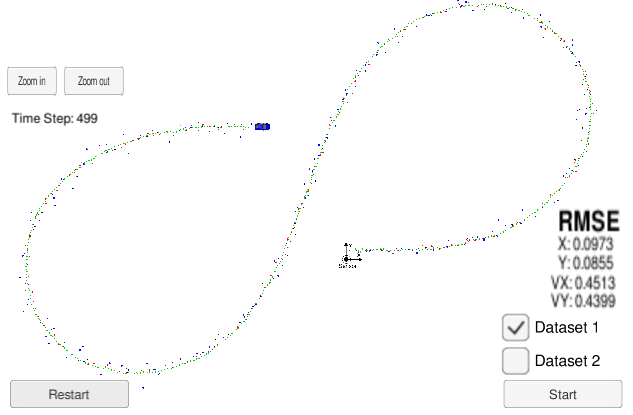

# Extended Kalman Filter Project

Project 5 of Self-Driving Car Engineer Nanodegree Program

## General Instructions

In this project you will utilize a kalman filter to estimate the state of a moving object of interest with noisy lidar and radar measurements. Passing the project requires obtaining RMSE values that are lower than the tolerance outlined in the project rubric. 

This project involves the Term 2 Simulator which can be downloaded [here](https://github.com/udacity/self-driving-car-sim/releases).

This repository includes two files that can be used to set up and install [uWebSocketIO](https://github.com/uWebSockets/uWebSockets) for either Linux or Mac systems. For windows you can use either Docker, VMware, or even [Windows 10 Bash on Ubuntu](https://www.howtogeek.com/249966/how-to-install-and-use-the-linux-bash-shell-on-windows-10/) to install uWebSocketIO. Please see the uWebSocketIO Starter Guide page in the classroom within the EKF Project lesson for the required version and installation scripts.

Once the install for uWebSocketIO is complete, the main program can be built and run by doing the following from the project top directory.

1. mkdir build
2. cd build
3. cmake ..
4. make
5. ./ExtendedKF

Tips for setting up your environment can be found in the classroom lesson for this project.

Note that the programs that need to be written to accomplish the project are src/FusionEKF.cpp, src/FusionEKF.h, kalman_filter.cpp, kalman_filter.h, tools.cpp, and tools.h

The program main.cpp has already been filled out, but feel free to modify it.

Here is the main protocol that main.cpp uses for uWebSocketIO in communicating with the simulator.

**INPUT**: values provided by the simulator to the c++ program

["sensor_measurement"] => the measurement that the simulator observed (either lidar or radar)

**OUTPUT**: values provided by the c++ program to the simulator

["estimate_x"] <= kalman filter estimated position x

["estimate_y"] <= kalman filter estimated position y

["rmse_x"]

["rmse_y"]

["rmse_vx"]

["rmse_vy"]

---

## Dependencies

* cmake >= 3.5
  * All OSes: [click here for installation instructions](https://cmake.org/install/)
* make >= 4.1 (Linux, Mac), 3.81 (Windows)
  * Linux: make is installed by default on most Linux distros
  * Mac: [install Xcode command line tools to get make](https://developer.apple.com/xcode/features/)
  * Windows: [Click here for installation instructions](http://gnuwin32.sourceforge.net/packages/make.htm)
* gcc/g++ >= 5.4
  * Linux: gcc / g++ is installed by default on most Linux distros
  * Mac: same deal as make - [install Xcode command line tools](https://developer.apple.com/xcode/features/)
  * Windows: recommend using [MinGW](http://www.mingw.org/)

## Basic Build Instructions

1. Clone this repo.
2. Build and compile in one command with `MakeFile`:
     - Run: `make build`
    
    or manually build and compile:

     - Make a build directory: `mkdir build && cd build`
     - Compile: `cmake .. && make` 
        * On windows, you may need to run: `cmake .. -G "Unix Makefiles" && make`
3. Run it: `./ExtendedKF `

## Editor Settings

We've purposefully kept editor configuration files out of this repo in order to
keep it as simple and environment agnostic as possible. However, we recommend
using the following settings:

* indent using spaces
* set tab width to 2 spaces (keeps the matrices in source code aligned)

## Code Style

Please (do your best to) stick to [Google's C++ style guide](https://google.github.io/styleguide/cppguide.html).

## Generating Additional Data

This is optional!

If you'd like to generate your own radar and lidar data, see the
[utilities repo](https://github.com/udacity/CarND-Mercedes-SF-Utilities) for
Matlab scripts that can generate additional data.

# Results

This are the results on the simulator:

These are the resuls printed on terminal for the `dataset 1`:

| Iteration # |rmse px | rmse py | rmse vx | rmse vy | x px | x py | x vx | x vy | P(0,0) | P(0,0) |P(0,0) |P(0,0) |P(0,0) |P(0,0) |P(0,0) |P(0,0) |P(0,0) |P(0,0) |P(0,0) |P(0,0) |P(0,0) |P(0,0) |P(0,0) |P(0,0) |
|---|---|---|---|---|---|---|---|---|---|---|---|---|---|---|---|---|---|---|---|---|---|---|---|---|
| 1 | 0.288 | 0.020 | 5.200 | 0.000 | 0.312 | 0.580 | 0.000 | 0.000 | 1.000 | 0.000 | 0.000 | 0.000 | 0.000 | 1.000 | 0.000 | 0.000 | 0.000 | 0.000 | 1000.000 | 0.000 | 0.000 | 0.000 | 0.000 | 1000.000 |
| 2 | 0.211 | 0.088 | 3.818 | 1.396 | 0.780 | 0.722 | 6.653 | 1.977 | 0.019 | 0.034 | 0.004 | -0.002 | 0.034 | 0.064 | -0.002 | 0.002 | 0.004 | -0.002 | 221.662 | -119.214 | -0.002 | 0.002 | -119.214 | 64.231 |
| 3 | 0.178 | 0.081 | 4.295 | 1.140 | 1.195 | 0.535 | 10.317 | -0.011 | 0.021 | -0.002 | 0.338 | -0.181 | -0.002 | 0.019 | -0.181 | 0.099 | 0.338 | -0.181 | 6.905 | -3.655 | -0.181 | 0.099 | -3.655 | 2.079 |
| 4 | 0.232 | 0.072 | 3.731 | 1.628 | 1.032 | 0.564 | 4.613 | 2.601 | 0.005 | 0.003 | 0.021 | -0.023 | 0.003 | 0.004 | 0.007 | -0.003 | 0.021 | 0.007 | 0.130 | -0.103 | -0.023 | -0.003 | -0.103 | 0.225 |
|---|---|---|---|---|---|---|---|---|---|---|---|---|---|---|---|---|---|---|---|---|---|---|---|---|
| Last | 0.097 | 0.085 | 0.451 | 0.440 | -7.232 | 10.896 | 5.195 | 0.061 | 0.007 | 0.002 | 0.018 | 0.007 | 0.002 | 0.005 | 0.008 | 0.011 | 0.018 | 0.008 | 0.121 | 0.037 | 0.007 | 0.011 | 0.037 | 0.089 |

As we can see, the final root mean squared error (rmse) for positions are lower than `0.1` and for velocities are lower than `0.46`.

When we analyze the covariance matrix P, when the Kalman Filter initialize with a Lidar measurement, the covariances for velocities was set `1000`. After 4 cycles, this covariances at same positions dropped bellow `1.0`, showing that the filter is much more certain about it after 4 prediction/measurement update, as shown by rsme.